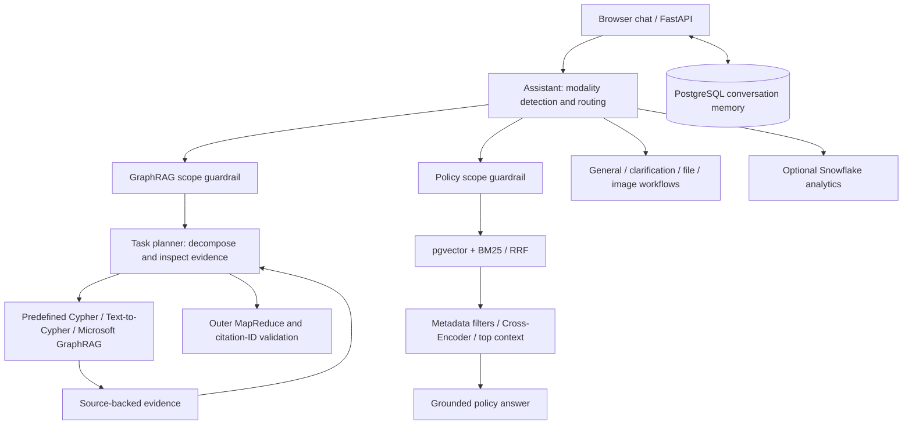

# Smart AI Support — GraphRAG & LangGraph Assistant

A business-support assistant that combines **LangGraph task planning,
Microsoft GraphRAG, Neo4j Text-to-Cypher, and hybrid policy retrieval** behind
a FastAPI API and browser chat interface. It routes questions to specialized
workflows, checks business scope, retrieves supporting evidence, and returns
cited answers with inspectable execution traces and PostgreSQL conversation memory.

Built as a portfolio prototype using synthetic business data. The original
OpenAI/Ollama streaming gateway remains available through `/api/chat` and
`/api/reason`; the main assistant experience is `/api/assistant`.

[](https://www.python.org/)
[](https://fastapi.tiangolo.com/)
[](https://www.langchain.com/)
[](https://www.langchain.com/langgraph)
[](https://www.sqlalchemy.org/)
[](https://www.postgresql.org/)
[](https://github.com/pgvector/pgvector)
[](https://www.snowflake.com/)
[](https://alembic.sqlalchemy.org/)
[](#testing)

Example workflows include comparing product relationships and sales using
Neo4j, summarizing review themes with Microsoft GraphRAG, and answering return
or support-policy questions using reranked Knowledge Base passages. The browser
shows the selected route, scope decision, planner tasks and cited sources.

**Orchestration, not an autonomous agent swarm:** the active GraphRAG supervisor
decomposes questions into bounded subtasks and dispatches retrieval tools. It
does not launch independent `reviews_agent` or `catalog_agent` instances.

New to the codebase? Start with the [project map and reading order](docs/project-map.md).
Operational guides are indexed in [docs/README.md](docs/README.md).

## Tech stack

**Generative AI:** Retrieval-Augmented Generation (RAG), LangChain, LangGraph,
LangChain Expression Language (LCEL), prompt engineering, Pydantic structured
output, Microsoft GraphRAG, community detection, Local/Global/DRIFT search,
semantic search, text embeddings, vector similarity search, grounded
generation, source citations, OpenAI Responses API, and Ollama.

**Backend and data:** Python, FastAPI, asynchronous APIs, Server-Sent Events
(SSE), PostgreSQL 17, pgvector, HNSW indexing, async SQLAlchemy ORM, asyncpg,
Alembic migrations, Snowflake, dimensional analytics, parameterized SQL,
Pydantic, Docker Compose, REST APIs, and dependency injection.

**Engineering:** Object-oriented design, Factory and Adapter patterns,
provider-agnostic model integration, stateful multi-turn conversations,
multimodal image understanding, pytest, Postman, and idempotent data ingestion.

---

## Highlights

| | |
|---|---|
| **SSE interface** | Chat/reason stream provider output. GraphRAG streams progress, validates its final answer, then emits buffered answer chunks rather than raw model tokens. |
| **Provider-agnostic** | `LLMServiceFactory` returns an adapter chosen from configuration. Swapping OpenAI ⇄ Ollama requires no client or endpoint changes. |
| **LangChain integration** | Explicit core dependencies support structured classification and planning. Chat/reason can select native or LangChain provider adapters through configuration. |
| **LangGraph assistant** | Classifies each query, follows a conditional graph branch, and streams a grounded answer with visible route and source metadata. |
| **Knowledge Base RAG** | Scope-guarded pgvector + BM25 hybrid retrieval, RRF, metadata filtering, local Cross-Encoder reranking and cited answers. |
| **Snowflake analytics** | Routes aggregate business questions through a structured plan and allowlisted SQL templates, then grounds the answer in warehouse rows. |
| **GraphRAG task planning** | A guarded LangGraph planner decomposes business queries into subtasks and directly dispatches predefined Cypher, constrained Text-to-Cypher and Microsoft GraphRAG tools. Includes bounded parallelism, evidence-driven dependencies and final MapReduce synthesis. See [architecture](docs/graph-task-planner.md). |
| **Checked graph answers** | Schema-constrained Cypher, independent question-alignment review and Neo4j EXPLAIN preflight; parallel evidence mapping, answer reduction and source-ID validation produce a cited natural-language answer. |
| **Image understanding** | Validates an uploaded image locally, then streams analysis from OpenAI vision without persisting the upload. |
| **Stateful conversations** | Server-side history: send only the new user turn and the service prepends stored context. |
| **Durable & transactional** | Async SQLAlchemy + PostgreSQL persistence; a turn is committed atomically, and a conversation auto-created by a failed first stream is cleaned up rather than left orphaned. |
| **Versioned schema** | Alembic migrations are tracked independently of application startup — no implicit schema mutation on boot. |
| **Ownership enforced** | Conversation reads and mutations are scoped to a `user_id`; another user's thread is indistinguishable from a missing one (404). |
| **Tested two ways** | Deterministic `pytest` suite (no API credits, no Ollama required) plus a Postman collection that asserts against *live* providers. |

---

## Architecture



Microsoft GraphRAG uses an isolated Parquet/LanceDB index, not the Neo4j
database. Local Search is the default; Global Search is an explicit request
choice. Global has its own internal MapReduce, while the application's outer
MapReduce combines evidence across tools. A rejected scope check stops that
branch before retrieval. Read-only query validation remains separate from scope.
Neo4j query tools read dataset-scoped schema metadata before planning, intersect
it with an explicit allowlist, and validate compiled queries against that observed
schema. New database fields do not automatically become queryable.
Relationship arrows are aligned to actual Neo4j directions for both dynamic
plans and predefined templates; missing or ambiguous directions fail closed.

**Request flow:** `POST /api/chat` → load stored history → merge with incoming
messages → factory selects an adapter → provider stream → completed turn saved
atomically → `[DONE]`.

The factory keys on *provider*, *service type* (`chat`, `reason`, and a reserved
`recommendation` slot), and *orchestrator* (`native` or `langchain`). New model
runtimes plug in without touching routing code — an application of the factory +
adapter patterns.

---

## API

### Inference

| Method | Endpoint | Description |
|---|---|---|
| `POST` | `/api/chat` | Stateful multi-turn conversation. Returns a `conversation_id`; reuse it and send only the new turn. |
| `POST` | `/api/reason` | Stateless reasoning-oriented response — a reasoned final answer plus a concise explanation (not hidden chain of thought). |
| `POST` | `/api/classify` | Structured routing: `general_search`, `file_query`, `policy_search`, `additional_search`, `analytics_search`, or `graph_rag_search`. |
| `POST` | `/api/graphrag/guardrail` | Model-backed scope assessment and backend recommendation; no graph retrieval or conversation writes. |
| `GET` | `/api/graphrag/status` | Inspect verified Microsoft GraphRAG index readiness and available search modes. |
| `POST` | `/api/graphrag/query` | Guarded adaptive supervisor with real Microsoft GraphRAG evidence; unavailable adapters fail explicitly. |
| `POST` | `/api/assistant` | Stateful multimodal LangGraph assistant. Accepts text JSON or multipart image input and persists completed turns. |
| `GET` | `/api/knowledge/status` | Show compatible indexed document/chunk counts and embedding configuration. |

### Conversation management

| Method | Endpoint | Description |
|---|---|---|
| `POST` | `/api/conversations` | Create a thread explicitly |
| `PATCH` | `/api/conversations/{id}` | Rename (`{"user_id": "...", "title": "..."}`) |
| `DELETE` | `/api/conversations/{id}?user_id=` | Delete (cascades messages, `204`) |
| `GET` | `/api/users/{user_id}/conversations` | List a user's threads |
| `GET` | `/api/conversations/{id}/messages?user_id=` | Read stored turns in order |

### Streamed response format

```
event: metadata
data: {"provider":"openai","model":"...","service":"chat","conversation_id":"..."}

event: delta
data: {"content":"FastAPI"}

event: done
data: "[DONE]"
```

Interactive docs are served at `/docs`; liveness at `/health`.

Each business branch has at most one scope guardrail; the GraphRAG supervisor
does not repeat scope assessment for subtasks. Database read-only and query
validation checks remain. See [branch scope policy](docs/branch-guardrails.md).

See [GraphRAG guardrail and backend selection](docs/graphrag.md) for the policy,
real-model evaluation commands, Postman checks, and Microsoft GraphRAG indexing
preparation. [Microsoft GraphRAG setup and live tests](docs/microsoft-graphrag.md)
documents the isolated runtime, real index, and supported query modes. Scope
approval is not execution authorization. [Neo4j query strategies](docs/neo4j-query-strategies.md)
documents the independent graph database, transactional snapshot and two query paths.

---

## Quick start

### 1. Install and run the core assistant

Prerequisites: Python 3.13, Docker Compose, and either an OpenAI API key or a
running Ollama server with a chat model. Python 3.11 is also covered by CI.
Clone the repository, then run the setup commands from its root:

```bash
git clone https://github.com/Tianyibian/llm-gateway-api.git
cd llm-gateway-api
python3.13 -m venv .venv-langchain
source .venv-langchain/bin/activate
python -m pip install -r requirements.txt
python -m pip check

cp .env.example .env
```

Edit `.env` locally: set `LLM_PROVIDER=openai`, a real `OPENAI_API_KEY`, and chat,
reasoning and vision model IDs available to your account. Alternatively, use
`LLM_PROVIDER=ollama` and pull the configured chat/reasoning model (the example
uses `ollama pull qwen3:4b`). Images still require OpenAI. Never commit `.env`.

Then start persistence and the API:

```bash
docker compose -f compose.yaml up -d postgres
python -m alembic upgrade head
python -m uvicorn app.main:app --reload
```

This starts the core application, not prebuilt retrieval indexes. Start with a
general question; policy and graph questions require the setup below. A fresh
clone does not include local indexes, model weights, secrets or loaded databases.

Open `http://127.0.0.1:8000` for the local Aster assistant interface. It is
served by FastAPI and requires no separate JavaScript build process.
The chat now shows graph index readiness and expandable router, guardrail,
supervisor-task, and source details. See [chat testing](docs/chat-testing.md)
for examples and the distinction between saved messages and session-only traces.

```bash
curl -N -X POST http://127.0.0.1:8000/api/chat \
  -H 'Content-Type: application/json' \
  -d '{"user_id":"demo-user","messages":[{"role":"user","content":"Explain FastAPI in two sentences."}]}'
```

`-N` disables curl buffering so deltas appear as they stream.

### 2. Enable retrieval features

For the complete policy pipeline, leave `RAG_RERANKER_ENABLED=true`, start the
Ollama server, and run in another terminal with the app environment activated:

```bash
python -m pip install -r requirements/reranker.txt
python -m app.cli.prepare_policy_reranker
ollama pull embeddinggemma
python -m app.cli.ingest_knowledge
```

The reranker downloads local weights. Missing weights fail explicitly; they do
not silently disable reranking. See [policy retrieval](docs/policy-reranker.md).

Other backends are opt-in and require data preparation as well as installation:

| Feature | Dependencies and setup |
|---|---|
| Neo4j templates and Text-to-Cypher | Driver included in the root install; follow [database loading and read-only setup](docs/neo4j-query-strategies.md). |
| Microsoft GraphRAG Local/Global | Separate `.venv-graphrag`, `requirements/graphrag.txt`, then [prepare, index and verify](docs/microsoft-graphrag.md). Indexing calls paid models; begin with a reviewed pilot. |
| Official GraphRAG source | Initialize the pinned submodule only when needed; follow [source installation](docs/microsoft-graphrag.md#source-installation). |
| Snowflake analytics | `python -m pip install -r requirements/snowflake.txt`; follow [authentication](docs/snowflake-authentication.md) and the warehouse setup below. |

Business analytics default to Neo4j. Snowflake requires both
`SNOWFLAKE_ENABLED=true` and `ANALYTICS_BACKEND=snowflake`. Backend failures never
silently switch databases. Restart the API after configuration changes.

---

## Configuration

| Variable | Purpose |
|---|---|
| `LLM_PROVIDER` | `openai` · `ollama` · `auto` (uses OpenAI when a valid key is present, otherwise Ollama) |
| `LLM_ORCHESTRATOR` | `native` (default) · `langchain` (optional model abstraction) |
| `OPENAI_API_KEY` | Required only for the OpenAI path |
| `OPENAI_CHAT_MODEL` / `OPENAI_REASON_MODEL` | Model per service type |
| `OLLAMA_BASE_URL` / `OLLAMA_CHAT_MODEL` / `OLLAMA_REASON_MODEL` | Local inference, no key required |
| `DATABASE_URL` | Async PostgreSQL URL using the `postgresql+asyncpg` driver |
| `DATABASE_POOL_SIZE` / `DATABASE_MAX_OVERFLOW` | Base and burst capacity for SQLAlchemy's async connection pool |
| `DATABASE_POOL_TIMEOUT_SECONDS` | Maximum wait for an available pooled connection |
| `DATABASE_POOL_RECYCLE_SECONDS` | Maximum lifetime before a pooled connection is replaced |
| `BUSINESS_DATA_DIR` | Directory containing `Products.csv`, `Categories.csv`, and `Suppliers.csv` |
| `KNOWLEDGE_BASE_DIR` | Directory containing supported RAG source files |
| `RAG_EMBEDDING_PROVIDER` | `ollama` (local) or `openai`; independent of the answer-model provider |
| `OLLAMA_EMBEDDING_MODEL` / `OPENAI_EMBEDDING_MODEL` | Embedding model selected by the RAG provider |
| `RAG_CHUNK_SIZE` / `RAG_CHUNK_OVERLAP` | Character-based chunking settings |
| `RAG_RETRIEVAL_K` | Maximum number of chunks supplied to the grounded answer prompt |
| `GRAPHRAG_GUARDRAIL_TIMEOUT_SECONDS` | Maximum duration of a graph scope assessment; default 90 seconds |
| `GRAPHRAG_GUARDRAIL_MIN_CONFIDENCE` | Additional clarification threshold, not a calibrated safety guarantee; default 0.75 |
| `MICROSOFT_GRAPHRAG_ENABLED` | Opt in to the real Microsoft GraphRAG adapter; default `false` |
| `MICROSOFT_GRAPHRAG_ROOT` / `MICROSOFT_GRAPHRAG_PYTHON` | Server-owned verified workspace and isolated worker interpreter |
| `MICROSOFT_GRAPHRAG_TIMEOUT_SECONDS` | Worker deadline; default 90 seconds |
| `SNOWFLAKE_ENABLED` | Enable the optional Snowflake analytics branch; PostgreSQL remains the conversation database |
| `SNOWFLAKE_ACCOUNT` / `SNOWFLAKE_USER` | Server-side Snowflake account and application identity |
| `SNOWFLAKE_AUTH_METHOD` | Explicit `key_pair` (recommended) or legacy `password`; no automatic authentication fallback |
| `SNOWFLAKE_PRIVATE_KEY_FILE` / `SNOWFLAKE_PRIVATE_KEY_PASSPHRASE` | Local PEM private key path and optional decryption passphrase; never commit either secret |
| `SNOWFLAKE_WAREHOUSE` / `SNOWFLAKE_DATABASE` / `SNOWFLAKE_SCHEMA` | Snowflake query context |
| `SNOWFLAKE_ROLE` | Read-only application role used by assistant queries |
| `OPENAI_VISION_MODEL` | OpenAI model used only for explicit image-analysis requests |
| `OPENAI_VISION_DETAIL` | `low`, `high`, `original`, or `auto`; defaults to `high` |
| `VISION_MAX_IMAGE_BYTES` | Local upload limit; defaults to 10 MB |

Both providers share one request schema and one SSE contract, so switching is a
configuration change — clients and tests stay identical. Restart Uvicorn after
editing `.env`.

### Provider adapter selection

LangChain is an orchestration layer, not another model provider. With
`LLM_ORCHESTRATOR=langchain`, the factory still selects OpenAI or Ollama, then
wraps that provider's LangChain chat model behind the same local `LLMService`
interface. Conversation persistence, ownership checks, SSE, and API contracts
do not change.

LangChain and LangGraph are installed by the root `requirements.txt`; they are
required by the assistant even when chat/reason use the native provider adapter.
`requirements/langchain.txt` remains a compatibility alias, not a separate
optional runtime installation.

Then set these values in the local `.env` and restart Uvicorn:

```dotenv
LLM_ORCHESTRATOR=langchain
LLM_PROVIDER=ollama
```

Use `LLM_PROVIDER=openai` instead to run the same adapter through OpenAI. Set
`LLM_ORCHESTRATOR=native` to return to the direct SDK/HTTP implementations.

The `/api/classify` endpoint always uses the LangChain runtime because
it combines `ChatPromptTemplate` with the provider model's structured-output
interface. Classification completes before routing and therefore returns one
validated JSON object rather than an SSE stream.

```bash
curl -X POST http://127.0.0.1:8000/api/classify \
  -H 'Content-Type: application/json' \
  -d '{"query":"Can I return a smart lock after installation?"}'
```

See [Local vs Global Search](docs/local-global-search.md) for the review search
selector: Local is the default; Global is an explicit per-request choice.

### LangGraph assistant

The browser UI and `/api/assistant` use a compiled `StateGraph`:

```text
START -> detect_modality
              |
              +-> vision_answer (OpenAI) ------------> END
              +-> prepare_file -> file_answer --------> END
              +-> classify_query
                        |
                        +-> general_answer ---------------------> END
                        +-> clarify_request -> next route or END
                        +-> prepare_file -> attachment reminder -> END
                        +-> retrieve_knowledge -> knowledge_answer -> END
                        +-> graph_rag -> scope gate -> supervisor -> END
                        +-> plan_analytics -> query_snowflake
                                              -> analytics_answer -> END
```

The graph has separate input, output, and overall state schemas. Every node
returns only its state update. The conditional edge reads `state["route"]` and
selects the next node. Catalog relationships are handled by the guarded GraphRAG
branch and its Neo4j retrieval tools, not an independent CSV search. SSE events expose `metadata`, `route`, optional `sources`, answer
`delta` chunks, and `done`. GraphRAG answer chunks are emitted after final
validation; other answer branches stream model output. Before execution, the endpoint loads the owned
conversation history from PostgreSQL. After a successful stream, it atomically
saves the user query and complete assistant answer as one turn.

The independent CSV product route has been removed, not product-query capability.
Catalog discovery and product questions belong to GraphRAG. Current adapters lack
authoritative current prices, live inventory, technical specifications and verified
compatibility. Such questions pass business scope but receive an explicit data
limitation, not invented facts or an out-of-scope rejection. `Business_data/` remains the source for
Neo4j ingestion, Microsoft GraphRAG preparation and analytics comparisons.
Policy documents use the guarded pgvector + BM25 Knowledge Base ensemble. Images
use the vision branch. The separate `file_query` branch supports request-scoped
TXT, Markdown and text-based PDF questions with excerpt/page citations. Files
are not added to shared indexes; reattach for follow-ups. See the
[file-query guide](docs/file-query.md) for limits, privacy and live test steps.

### Snowflake business analytics

Snowflake is an optional OLAP backend; it does not replace PostgreSQL. The
assistant can route cross-record aggregation and trend questions to Snowflake
when explicitly selected with both configuration flags above,
while conversations and messages remain in the transactional PostgreSQL
database. The analytics planner returns a validated `AnalyticsQueryPlan`, not
SQL. The execution service maps its intent to one of four parameterized,
read-only templates:

- `top_products_by_revenue`
- `monthly_sales_trend`
- `supplier_performance`
- `category_performance`

Each query has a maximum 20-row result, a statement timeout, a query tag, and a
Snowflake query ID in the SSE source metadata when the driver provides one.

Set up a development account in this order:

1. Open `snowflake/setup.sql` in a Snowflake worksheet and run it with an
   administrative role. Replace `YOUR_USER` in the final commented grant and
   run that grant for the application user.
2. Install the optional driver:

   ```bash
   python -m pip install -r requirements/snowflake.txt
   ```

3. Follow [Snowflake authentication](docs/snowflake-authentication.md) to prepare
   a local key pair and register its public key with the intended Snowflake user.
   Copy the Snowflake variables from `.env.example` into the local `.env` and
   configure the account, user, private key path, and passphrase. Only enable
   `SNOWFLAKE_ENABLED=true` after authentication and role grants are ready.
   Keep `ANALYTICS_BACKEND=neo4j` for the default prototype; select
   `ANALYTICS_BACKEND=snowflake` only after loading and verification.
   Never put Snowflake credentials in Git, Postman, or browser code. Existing
   password mode remains available only where the account's policy permits it.
4. Run `python -m app.cli.prepare_snowflake_loader` to prepare a separate
   encrypted loading key and private `.env.snowflake-loader`. Both are excluded
   from Git and Docker. Execute the generated public-key-only script at
   `.local/snowflake/loader/setup_loader.sql` in an authorized administrator
   worksheet. It grants the separate loader SELECT/INSERT on exactly five
   tables and access to a named staging area; the assistant stays read-only.
   Then upload all fields and records from the five source files:

   ```bash
   python -m app.cli.load_snowflake
   ```

   The initial loader refuses nonempty targets, never truncates, and validates
   all five COPY row counts before committing one transaction. Run only one
   loader at a time; it is not a concurrent ingestion coordinator. Staged copies
   remain for diagnosis and may incur storage charges. Local CSVs are unchanged.
5. Run `python -m app.cli.verify_snowflake` to check table counts and 12 report
   comparisons against CSV. Set `SNOWFLAKE_ENABLED=true` and
   `ANALYTICS_BACKEND=snowflake`, restart the API, and send an analytics question
   through `/api/assistant`:

   ```bash
   curl -N -X POST http://127.0.0.1:8000/api/assistant \
     -H 'Content-Type: application/json' \
     -d '{"query":"Which five products generated the most revenue in 2025?","user_id":"analytics-demo"}'
   ```

The `Snowflake Analytics - Live` Postman folder verifies the same full route.
Its tests require a configured account and real loaded data; pytest continues
to use deterministic fakes and consumes no Snowflake credits.

#### CSV vs. Snowflake comparison experiment

The local CSV implementation acts as a correctness baseline. The comparison
command runs the same plan against CSV and Snowflake concurrently, normalizes
Snowflake numeric types and column casing, prints both durations and row sets,
and exits with status `0` only when the results match:

```bash
python -m app.cli.compare_analytics \
  --intent top_products_by_revenue \
  --start-date 2025-01-01 \
  --end-date 2025-12-31 \
  --limit 5
```

Run the other three intents with the same command. Latency is informative but
not directly comparable as a benchmark: Snowflake includes network transport
and may need to resume a suspended warehouse, whereas CSV executes in the API
process. A later retrieval experiment can compare pgvector with Snowflake
Cortex Search on the same Knowledge Base queries, relevance labels, and `k`.

### Knowledge Base RAG

The ingestion command loads each FAQ row, HTML help article, non-empty PDF page,
and DOCX document as a versioned source unit. It normalizes text, creates
overlapping chunks, generates 768-dimensional embeddings, and stores them in
PostgreSQL with a pgvector HNSW cosine index. Checksums make ingestion
idempotent: unchanged sources are skipped, changed sources are replaced, and
removed sources are deleted.

```bash
docker compose up -d postgres
alembic upgrade head
ollama pull embeddinggemma
python -m app.cli.ingest_knowledge
curl http://127.0.0.1:8000/api/knowledge/status
```

Set `RAG_EMBEDDING_PROVIDER=openai` to use `text-embedding-3-small` instead.
The OpenAI key stays server-side; the local Ollama default requires no key or
embedding API credits. Run ingestion again after changing the embedding model
or provider. Retrieval refuses to mix vectors from a different configured
embedding space.

`policy_search` unifies return/refund policies and company support knowledge. A
fail-closed scope guardrail runs before retrieval, including when clarification
dispatches to this branch. The retriever combines exact pgvector cosine rankings
and BM25 lexical rankings using reciprocal-rank fusion (RRF), deduplicating by
chunk ID. The bounded prototype scans the eligible corpus rather than using the
available HNSW index, so BM25 can recover hits outside vector candidates. Only
`visibility=public` documents are eligible for assistant retrieval. Internal
support DOCX files are indexed with `visibility=internal` as preparation for
future role-based access, but the public assistant's SQL filter cannot return
them. Each SSE `sources` event includes title, file, type, category, PDF page,
chunk index, vector/BM25 ranks, RRF provenance and Cross-Encoder relevance scores
(not confidence percentages). After hybrid fusion, explicit metadata filters narrow
the candidate set and the local reranker selects top context chunks; the answer
prompt cites only these selected excerpts as `[1]`, `[2]`, and so on.
Prepare the local model with the [reranker setup guide](docs/policy-reranker.md).
See [Policy ensemble retrieval](docs/policy-ensemble.md) for configuration,
limitations and separate deterministic/live testing commands.

### Image analysis

Attaching an image in the browser sends a multipart request to the same
`/api/assistant` endpoint used for text. The `detect_modality` node routes it to
the graph's `vision_answer` branch. This branch is intentionally OpenAI-only
even when `LLM_PROVIDER=ollama`; the
OpenAI key remains server-side in `.env`, and the browser never receives it.
The backend verifies the actual image content with Pillow, permits PNG, JPEG,
WEBP, and non-animated GIF, enforces a 10 MB local limit, converts the bytes to
a Base64 data URL, and streams only response text. The application does not
save the image bytes in PostgreSQL or the project directory. It saves the
question and textual image analysis, so later turns can use that text as
conversation context. Image inputs consume
billable tokens, so the API is called only after the user explicitly attaches
and sends an image.

```bash
curl -N -X POST http://127.0.0.1:8000/api/assistant \
  -F 'query=Read the visible text in this image.' \
  -F 'user_id=demo-user' \
  -F 'image=@/absolute/path/to/image.png;type=image/png'
```

**Secrets:** `.env` is git-ignored and only `.env.example` is committed; keys
never appear in source, docs, or requests. Verify with `git check-ignore -v .env`.
The Compose credentials are intentionally local-development defaults; replace
them with managed secrets in any shared or deployed environment.

---

## PostgreSQL database

The application uses PostgreSQL 17 with pgvector through SQLAlchemy's async
`asyncpg` driver.
The local service is defined in `compose.yaml`; its data survives container
restarts in the `postgres_data` Docker volume.

```bash
docker compose up -d postgres
docker compose ps
alembic upgrade head
alembic current
alembic check
```

Stop the local database without deleting its volume:

```bash
docker compose stop postgres
```

### Migrate existing SQLite data

Apply the schema to an empty PostgreSQL database first, then validate and run
the copy:

```bash
docker compose up -d postgres
alembic upgrade head
python -m scripts.migrate_sqlite_to_postgres --dry-run
python -m scripts.migrate_sqlite_to_postgres
```

The source defaults to `./llm_gateway.db`; override it with
`SQLITE_SOURCE_URL=sqlite+aiosqlite:////absolute/path/to/source.db` when needed.
The migration copies IDs, timestamps, conversations, and messages in one target
transaction, updates the PostgreSQL message-ID sequence, refuses a non-empty
target, masks the target password in output, and never modifies or deletes the
SQLite source. To roll back before removing the source, point `DATABASE_URL`
back to the preserved SQLite URL and restart Uvicorn.

---

## Testing

```bash
python -m pip check
python -c "import langchain, langgraph; from app.main import app; print(app.title)"
python -m pytest tests -q
```

The `pytest` suite runs against temporary SQLite databases with the provider
replaced by a deterministic fake, covering routing, request validation, factory
selection, SSE formatting, ownership rules, atomic turn persistence,
failed-first-turn cleanup, cascading deletes, history ordering, and Alembic
upgrade/downgrade, multi-format knowledge loading, chunking, embeddings, and
grounded citation routing. It also covers graph planning, constrained Cypher,
evidence lineage, MapReduce validation, hybrid retrieval, metadata filtering
and reranker failure behavior. It consumes no API credits and needs no local model.
Scope collection to `tests/` so upstream submodule tests are not collected.
CI installs only the root requirements, checks imports and runs this suite on
Python 3.11 and 3.13. Optional model/index integrations require separate live checks.
Four Snowflake driver-specific authentication tests skip when
`requirements/snowflake.txt` is not installed; the remaining warehouse logic
uses fakes. Installing that extra enables those tests without contacting Snowflake.

The Postman collection (`postman/`) is deliberately **not** mocked: it drives a
running Uvicorn process against real providers and asserts status, SSE content
type, the expected provider and service type, streamed output, `[DONE]`, and the
absence of an error event — including a seven-request stateful conversation flow.

Deterministic tests check application contracts, not model quality or live
service connectivity. Live evaluations require configured backends and may
incur API costs; see the [testing guides](docs/README.md).

---

## Project layout

```
app/                             # Application code; start with main.py
├── api/                         # HTTP endpoints and conversation CRUD
├── core/                        # Environment-backed configuration
├── db/                          # ORM models, sessions and connection pool
├── models/                      # Validated request, plan and evidence contracts
├── services/                    # Routing, agents, retrieval and model adapters
├── cli/                         # Ingestion, diagnostics and evaluation commands
└── static/                      # Browser chat UI and execution inspector
graphrag_runtime/                # Isolated Microsoft GraphRAG worker and templates
third_party/                     # Official GraphRAG source, pinned as a Git submodule
Business_data/                   # Synthetic source CSVs (paths preserved)
Knowledge Base/                  # Source documents for policy/support RAG
migrations/                     # Alembic database revisions
requirements/                   # Optional dependency sets; GraphRAG is isolated
requirements.txt                # Core app + LangChain/LangGraph; Docker/CI entry point
notebooks/                      # Exploration notebooks, separate from app code
scripts/                        # Migration utilities
└── reference/                   # Legacy preprocessing reference
tests/                          # Automated backend and frontend tests
postman/                        # Live API test collections
docs/                           # Architecture, setup and testing guides
snowflake/                      # Optional warehouse SQL setup
compose.yaml                    # Default local PostgreSQL service
compose.neo4j.yaml               # Explicit opt-in Neo4j stack
docker-compose.yml              # Alternative API + PostgreSQL stack; use -f
Dockerfile                      # Application image build
.local/                         # Ignored local indexes and diagnostics
```

Run application and setup commands from the repository root. Existing data,
virtual environments, local indexes and secrets have not moved. The optional
dependency files previously named `requirements-*.txt` now live in `requirements/`.
Do not run both PostgreSQL Compose stacks against the same port; use an explicit
`-f` when selecting the alternative stack, and preserve its existing data volume.

---

## Notes & limits

- This is a portfolio prototype, not a production security or reliability claim.
  Scope guardrails and citation-ID checks do not prove every answer is factual.
- Product and sales data are static snapshots, not live stock or price feeds.
  Microsoft GraphRAG summarizes review evidence; exact sales aggregates use
  database queries. DRIFT is an experimental low-level adapter, not a UI mode.
- Optional integrations, indexes and model artifacts need explicit setup. Dependency
  ranges are not a fully reproducible lockfile; verify each fresh installation.
- `user_id` is a demonstration ownership boundary, not authentication. A real
  deployment should derive identity from a verified token (e.g. JWT) rather than
  trusting client input.
- `LLM_PROVIDER=auto` resolves at service-construction time; it does not fail
  over mid-request after quota, billing, or network errors.
- `/api/reason` returns a reasoned answer and a short explanation by design — it
  does not expose a model's internal reasoning trace.

## License

No project license file is currently included. Third-party dependencies and
the GraphRAG submodule retain their respective licenses.
